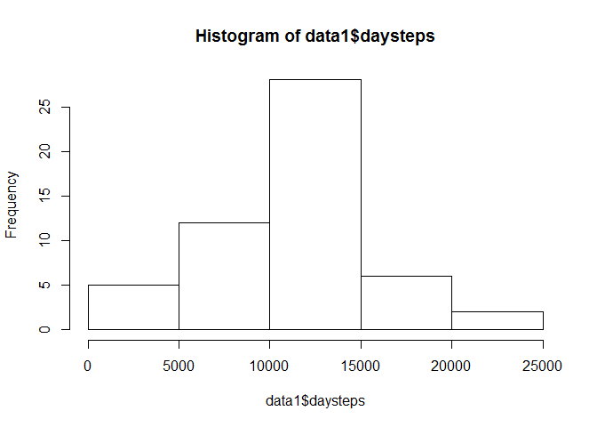

# Reproducible Research: Peer Assessment 1


```r
## Loading and preprocessing the data
library("readr")
```

```
## Warning: package 'readr' was built under R version 3.2.3
```

```r
data<-read_csv("activity.csv")
```


```r
## What is mean total number of steps taken per day?
library("dplyr")
```

```
## 
## Attaching package: 'dplyr'
## 
## The following objects are masked from 'package:stats':
## 
##     filter, lag
## 
## The following objects are masked from 'package:base':
## 
##     intersect, setdiff, setequal, union
```

```r
data1 <- data %>% group_by(date) %>% summarize(daysteps = sum(steps))
hist(data1$daysteps)
```

 

```r
summary(data1$daysteps)
```

```
##    Min. 1st Qu.  Median    Mean 3rd Qu.    Max.    NA's 
##      41    8841   10760   10770   13290   21190       8
```

## What is the average daily activity pattern?


## Imputing missing values


## Are there differences in activity patterns between weekdays and weekends?
